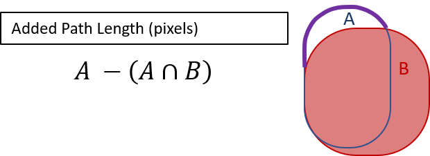
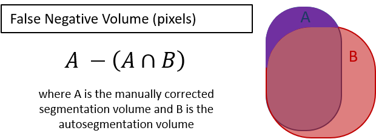

# Autosegmentation Spatial Similarity Metrics
__________________________________

### Python code to calculate the added path length, false negative path length, and false negative volume between an automated segmentation and its corresponding expert-corrected segmentation. 

The added path length (APL) is a novel metric [introduced by Vaassen et al.](https://doi.org/10.1016/j.phro.2019.12.001) and is conceptually the distance that an editor's cursor travels when making corrections to an automated segmentation. Numerically it is the number of pixels in the corrected segmentation surface that are not shared in the automated segmentation surface.

Vaassen et al. demonstrated that the APL correlates better with the time required to correct a segmentation than do traditional, popular metrics such as the volumetric Dice similarity coefficient or the Hausdorff distance. As a measure of autosegmentation spatial similarity to a reference segmentation, the APL captures the expected time-savings benefit of automated segmentation better than traditional metrics.

Inspired by the APL, we also present code for two related metrics that we term the false negative path length (FNPL) and the false negative volume (FNV). The FNPL is like the APL but excludes subtractive corrections to the autosegmentation.

The FNV is the corrected segmentation volume that is not included in the automated segmentation volume.

